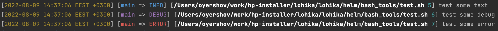

## Bash tools:

### Custom bash output logging:

- From current directory with scripts source <span style="color: orange; font-style: italic;">logger.sh</span> file:
```shell
$ source ./logger.sh -c=true
```

colors for output can include/exclude with flag <span style="color: orange; font-style: italic;">-c</span>

after this you can write beauty logs in terminal:
```shell
$ INFO "test some text"
$ DEBUG "test some debug"
$ ERROR "test some error"
```

output example:
